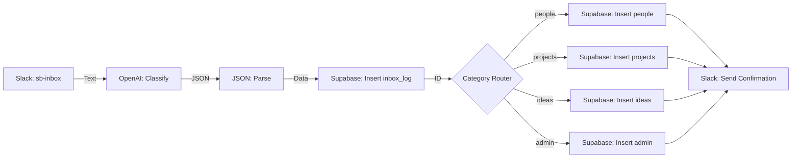

# Make.com Capture Flow Blueprint

This document outlines the visual automation flow we will build in Make.com. This flow takes text from Slack, classifies it with AI, and saves it to your Supabase database.

## System Architecture



---

## Module-by-Module Details

### 1. Slack: Watch Public Channel Messages
*   **Connection:** Connect to your Slack Workspace
*   **Channel Type:** Public Channel
*   **Channel:** `#sb-inbox`
*   **Limit:** 1

### 2. OpenAI (GPT-4o or latest): Create a Completion
*   **Model:** `gpt-4o` (or similar)
*   **Role:** `System`
*   **Prompt Content:** [classification-prompt.txt](file:///c:/Users/greg/OneDrive/Dev/nate-jones/second-brain/prompts/classification-prompt.txt)
*   **User Message:** `{{text}}` (from Slack module)

### 3. JSON: Parse JSON
*   **JSON String:** `{{choices[].message.content}}` (from OpenAI module)

### 4. Supabase: Insert a Row (inbox_log)
*   **Table:** `inbox_log`
*   **Values:**
    *   `raw_message`: `{{text}}` (from Slack)
    *   `category`: `{{category}}` (from JSON)
    *   `confidence`: `{{confidence}}` (from JSON)
    *   `ai_title`: `{{title}}` (from JSON)
    *   `ai_response`: `{{choices[].message.content}}` (Full string)
    *   `source`: `slack`
    *   `slack_thread_ts`: `{{ts}}` (from Slack module)

### 5. Router
*   Create 5 paths based on the `{{category}}` output from JSON module.

#### Path A: People
*   **Filter:** `category` Equal to `people`
*   **Module:** Supabase: Insert a Row (`people`)
    *   `name`: `{{title}}`
    *   `notes`: `{{summary}}`
    *   `inbox_log_id`: `{{id}}` (from inbox_log insert)

*   **Module 2:** Supabase: Make an API Call (Update inbox_log)
    *   **URL**: `/inbox_log?id=eq.{{inbox_log_insert_id}}`
    *   **Method**: `PATCH`
    *   **Body**:
        ```json
        {
          "target_table": "people",
          "target_id": "{{people_insert_id}}",
          "processed": true
        }
        ```

#### Path B: Projects
*   **Filter:** `category` Equal to `projects`
*   **Module:** Supabase: Insert a Row (`projects`)
    *   `title`: `{{title}}`
    *   `description`: `{{summary}}`
    *   `inbox_log_id`: `{{id}}`

#### Path C: Ideas
*   **Filter:** `category` Equal to `ideas`
*   **Module:** Supabase: Insert a Row (`ideas`)
    *   `title`: `{{title}}`
    *   `content`: `{{summary}}`
    *   `inbox_log_id`: `{{id}}`

*   **Module 2:** Supabase: Make an API Call (Update inbox_log)
    *   **URL**: `/inbox_log?id=eq.{{inbox_log_insert_id}}`
    *   **Method**: `PATCH`
    *   **Body**:
        ```json
        {
          "target_table": "ideas",
          "target_id": "{{ideas_insert_id}}",
          "processed": true
        }
        ```

#### Path D: Admin
*   **Filter:** `category` Equal to `admin`
*   **Module:** Supabase: Insert a Row (`admin`)
    *   `title`: `{{title}}`
    *   `description`: `{{summary}}`
    *   `inbox_log_id`: `{{id}}`

#### Path E: Needs Review
*   **Filter:** `category` Equal to `needs_review` **OR** `confidence` Less than `0.6`
*   **Module 1:** Supabase: Update Row/Upsert a Record (`inbox_log`)
    *   **ID**: `{{inbox_log_insert_id}}` (from the initial Create Row module)
    *   **processed**: `false`
    *   **target_table**: `needs_review`
*   **Module 2:** Slack: Send Channel Message (Reply in Thread)
    *   Channel: `#sb-inbox`
    *   Thread TS: `{{ts}}` (reply in original thread)
    *   Text:
    ```
    🤔 I'm not sure how to classify this (confidence: {{confidence}})

    Could you repost with a prefix?
    - "person: ..." for people
    - "project: ..." for projects
    - "idea: ..." for ideas
    - "admin: ..." for tasks/errands

    Or reply "fix: [category]" to classify this one.
    Example: "fix: people" or "fix: admin"
    ```

---

## Fix Flow (Reclassification)

When a user replies with `fix: [category]` in a thread, a **separate Make.com scenario** handles reclassification:

### Fix Scenario: "Second Brain - Fix Handler"

**Trigger:** Slack: Watch Public Channel Messages
*   Channel: `#sb-inbox`
*   Filter: Message contains `fix:` **AND** is a threaded reply

**Step 1: Parse the fix command**
*   **Module:** Text Parser: Match Pattern
*   **Pattern:** `fix:\s*(?<category>people|projects|ideas|admin)` (Case insensitive)
*   **Text:** `{{text}}` (from Slack Watch module)

**Step 2: Supabase: Select a Row (`inbox_log`)**
*   **Filter:** `slack_thread_ts` Equal to `{{thread_ts}}`
*   **Limit:** 1

**Step 3: OpenAI: Create a Completion**
*   **Model:** `gpt-4o`
*   **Prompt Content:** [fix-handler-prompt.txt](file:///c:/Users/greg/OneDrive/Dev/nate-jones/second-brain/prompts/fix-handler-prompt.txt)
*   **User Message:** Forced Category: `{{category}}` | Original Message: `{{raw_message}}` (from Select Row step)

**Step 4: JSON: Parse JSON**
*   **JSON String:** `{{choices[].message.content}}`

**Step 5: Router (By New Category)**
*   Paths A-D: Similar to Capture Flow, insert into the correct table.

**Step 6: Supabase: Update Row (`inbox_log`)**
*   **ID:** `{{id}}` (from Select Row step)
*   **Values:**
    *   `category`: `{{category}}` (the new one)
    *   `processed`: `true`
    *   `target_table`: `{{category}}`
    *   `target_id`: `{{new_record_id}}` (from insert step)

**Step 7: Slack: Send Channel Message** (Reply in Thread)
*   **Thread TS:** `{{thread_ts}}`
*   **Text:** `✅ Fixed! Classified as {{category}}: "{{title}}"`

### 6. Slack: Create a Message (Confirmation)
*   **Channel:** `#sb-inbox` (or a separate #sb-alerts channel)
*   **Text:** `✅ Saved to {{category}}: "{{title}}"`
*   **Thread ID:** `{{ts}}` (optional, to reply in thread)

---

## Preparation Checklist

Before we start Step 9, ensure you have:
1.  **Make.com Account:** Signed up and ready.
2.  **OpenAI API Key:** Found in your OpenAI Dashboard.
3.  **Supabase Credentials:** Already in our [.env.example](file:///c:/Users/greg/OneDrive/Dev/nate-jones/second-brain/config/.env.example).
