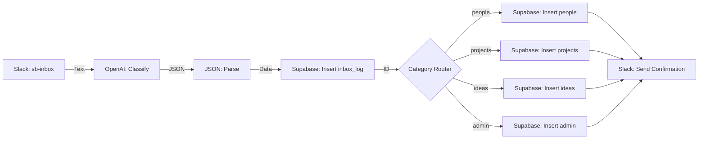

# Make.com Capture Flow Blueprint

This document outlines the visual automation flow we will build in Make.com. This flow takes text from Slack, classifies it with AI, and saves it to your Supabase database.

## System Architecture



---

## Module-by-Module Details

### 1. Slack: Watch Public Channel Messages
*   **Connection:** Connect to your Slack Workspace
*   **Channel Type:** Public Channel
*   **Channel:** `#sb-inbox`
*   **Limit:** 1

### 2. OpenAI (GPT-4o or latest): Create a Completion
*   **Model:** `gpt-4o` (or similar)
*   **Role:** `System`
*   **Prompt Content:** [classification-prompt.txt](file:///c:/Users/greg/OneDrive/Dev/nate-jones/second-brain/prompts/classification-prompt.txt)
*   **User Message:** `{{text}}` (from Slack module)

### 3. JSON: Parse JSON
*   **JSON String:** `{{choices[].message.content}}` (from OpenAI module)

### 4. Supabase: Insert a Row (inbox_log)
*   **Table:** `inbox_log`
*   **Values:**
    *   `raw_message`: `{{text}}` (from Slack)
    *   `category`: `{{category}}` (from JSON)
    *   `confidence`: `{{confidence}}` (from JSON)
    *   `ai_title`: `{{title}}` (from JSON)
    *   `ai_response`: `{{choices[].message.content}}` (Full string)
    *   `source`: `slack`

### 5. Router
*   Create 5 paths based on the `{{category}}` output from JSON module.

#### Path A: People
*   **Filter:** `category` Equal to `people`
*   **Module:** Supabase: Insert a Row (`people`)
    *   `name`: `{{title}}`
    *   `notes`: `{{summary}}`
    *   `inbox_log_id`: `{{id}}` (from inbox_log insert)

#### Path B: Projects
*   **Filter:** `category` Equal to `projects`
*   **Module:** Supabase: Insert a Row (`projects`)
    *   `title`: `{{title}}`
    *   `description`: `{{summary}}`
    *   `inbox_log_id`: `{{id}}`

#### Path C: Ideas
*   **Filter:** `category` Equal to `ideas`
*   **Module:** Supabase: Insert a Row (`ideas`)
    *   `title`: `{{title}}`
    *   `content`: `{{summary}}`
    *   `inbox_log_id`: `{{id}}`

#### Path D: Admin
*   **Filter:** `category` Equal to `admin`
*   **Module:** Supabase: Insert a Row (`admin`)
    *   `title`: `{{title}}`
    *   `description`: `{{summary}}`
    *   `inbox_log_id`: `{{id}}`

#### Path E: Needs Review
*   **Filter:** `category` Equal to `needs_review` **OR** `confidence` Less than `0.6`
*   **Module 1:** Supabase: Update Row (`inbox_log`)
    *   Filter by `id` = `{{inbox_log_id}}`
    *   Set `processed` = `false`
    *   Set `target_table` = `needs_review`
*   **Module 2:** Slack: Send Channel Message (Reply in Thread)
    *   Channel: `#sb-inbox`
    *   Thread TS: `{{ts}}` (reply in original thread)
    *   Text:
    ```
    🤔 I'm not sure how to classify this (confidence: {{confidence}})

    Could you repost with a prefix?
    - "person: ..." for people
    - "project: ..." for projects
    - "idea: ..." for ideas
    - "admin: ..." for tasks/errands

    Or reply "fix: [category]" to classify this one.
    Example: "fix: people" or "fix: admin"
    ```

---

## Fix Flow (Reclassification)

When a user replies with `fix: [category]` in a thread, a **separate Make.com scenario** handles reclassification:

### Fix Scenario: "Second Brain - Fix Handler"

**Trigger:** Slack: Watch Public Channel Messages
*   Channel: `#sb-inbox`
*   Filter: Message contains `fix:` **AND** is a threaded reply

**Step 1:** Parse the fix command
*   Extract category from message (e.g., "fix: people" → "people")
*   Get parent thread TS to find original inbox_log entry

**Step 2:** Supabase: Select Row from `inbox_log`
*   Filter: `source` = 'slack' AND match on Slack thread TS (stored in ai_response or a new field)

**Step 3:** ChatGPT: Re-classify with forced category
*   Prompt: "Extract structured data for a {{new_category}} record from: {{raw_message}}"
*   Return JSON matching the target table schema

**Step 4:** Router by new category
*   Route A-D: Insert into correct category table (people/projects/ideas/admin)

**Step 5:** Supabase: Update `inbox_log`
*   Set `category` = new category
*   Set `processed` = `true`
*   Set `target_table` = new category
*   Set `target_id` = new record ID

**Step 6:** Slack: Reply confirming fix
*   Text: `✅ Fixed! Moved to {{category}}: "{{title}}"`

### 6. Slack: Create a Message (Confirmation)
*   **Channel:** `#sb-inbox` (or a separate #sb-alerts channel)
*   **Text:** `✅ Saved to {{category}}: "{{title}}"`
*   **Thread ID:** `{{ts}}` (optional, to reply in thread)

---

## Preparation Checklist

Before we start Step 9, ensure you have:
1.  **Make.com Account:** Signed up and ready.
2.  **OpenAI API Key:** Found in your OpenAI Dashboard.
3.  **Supabase Credentials:** Already in our [.env.example](file:///c:/Users/greg/OneDrive/Dev/nate-jones/second-brain/config/.env.example).
