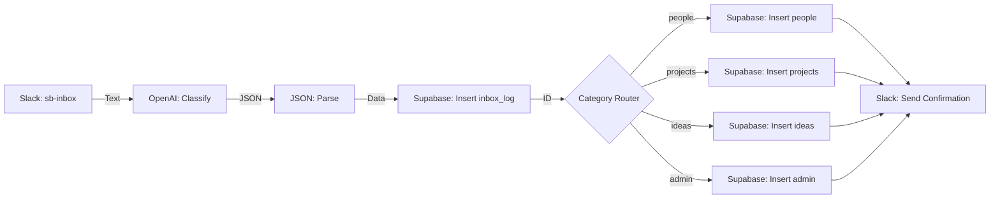

# Make.com Capture Flow Blueprint

This document outlines the visual automation flow we will build in Make.com. This flow takes text from Slack, classifies it with AI, and saves it to your Supabase database.

## System Architecture

---

## Module-by-Module Details

### 1. Slack: Watch Public Channel Messages
*   **Connection:** Connect to your Slack Workspace
*   **Channel Type:** Public Channel
*   **Channel:** `#sb-inbox`
*   **Limit:** 1

### 2. OpenAI (GPT-4o or latest): Create a Completion
*   **Model:** `gpt-4o` (or similar)
*   **Role:** `System`
*   **Prompt Content:** [classification-prompt.txt](file:///c:/Users/greg/OneDrive/Dev/nate-jones/second-brain/prompts/classification-prompt.txt)
*   **User Message:** `{{text}}` (from Slack module)

### 3. JSON: Parse JSON
*   **JSON String:** `{{choices[].message.content}}` (from OpenAI module)

### 4. Supabase: Insert a Row (inbox_log)
*   **Table:** `inbox_log`
*   **Values:**
    *   `raw_message`: `{{text}}` (from Slack)
    *   `category`: `{{category}}` (from JSON)
    *   `confidence`: `{{confidence}}` (from JSON)
    *   `ai_title`: `{{title}}` (from JSON)
    *   `ai_response`: `{{choices[].message.content}}` (Full string)
    *   `source`: `slack`

### 5. Router
*   Create 5 paths based on the `{{category}}` output from JSON module.

#### Path A: People
*   **Filter:** `category` Equal to `people`
*   **Module:** Supabase: Insert a Row (`people`)
    *   `name`: `{{title}}`
    *   `notes`: `{{summary}}`
    *   `inbox_log_id`: `{{id}}` (from inbox_log insert)

#### Path B: Projects
*   **Filter:** `category` Equal to `projects`
*   **Module:** Supabase: Insert a Row (`projects`)
    *   `title`: `{{title}}`
    *   `description`: `{{summary}}`
    *   `inbox_log_id`: `{{id}}`

#### Path C: Ideas
*   **Filter:** `category` Equal to `ideas`
*   **Module:** Supabase: Insert a Row (`ideas`)
    *   `title`: `{{title}}`
    *   `content`: `{{summary}}`
    *   `inbox_log_id`: `{{id}}`

#### Path D: Admin
*   **Filter:** `category` Equal to `admin`
*   **Module:** Supabase: Insert a Row (`admin`)
    *   `title`: `{{title}}`
    *   `description`: `{{summary}}`
    *   `inbox_log_id`: `{{id}}`

#### Path E: Needs Review
*   **Filter:** `category` Equal to `needs_review`
*   **Module:** (No insert needed, as it stays in `inbox_log` marked as processed)

### 6. Slack: Create a Message (Confirmation)
*   **Channel:** `#sb-inbox` (or a separate #sb-alerts channel)
*   **Text:** `✅ Saved to {{category}}: "{{title}}"`
*   **Thread ID:** `{{ts}}` (optional, to reply in thread)

---

## Preparation Checklist

Before we start Step 9, ensure you have:
1.  **Make.com Account:** Signed up and ready.
2.  **OpenAI API Key:** Found in your OpenAI Dashboard.
3.  **Supabase Credentials:** Already in our [.env.example](file:///c:/Users/greg/OneDrive/Dev/nate-jones/second-brain/config/.env.example).
